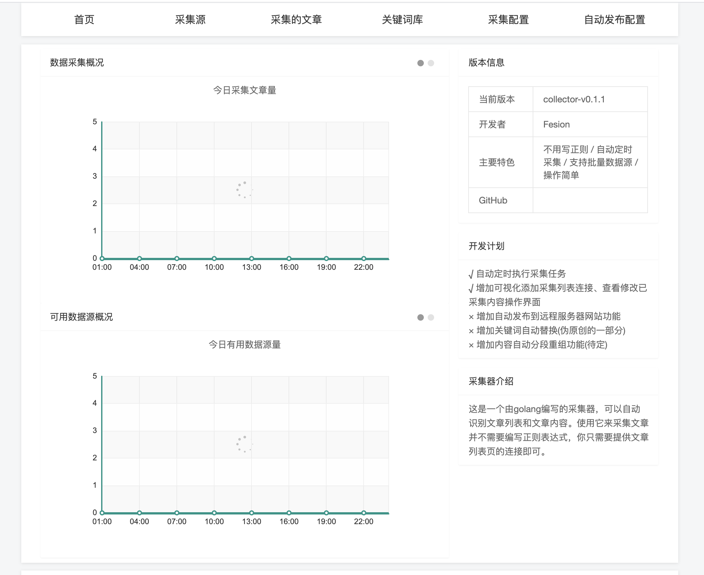
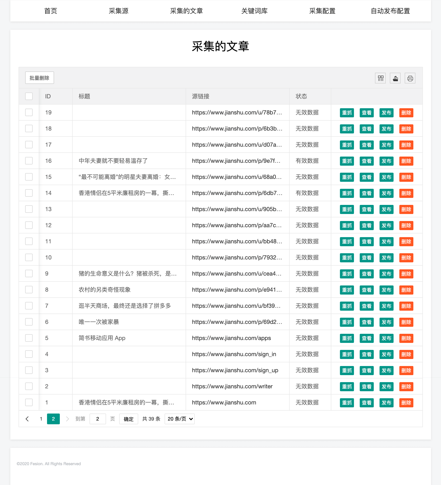
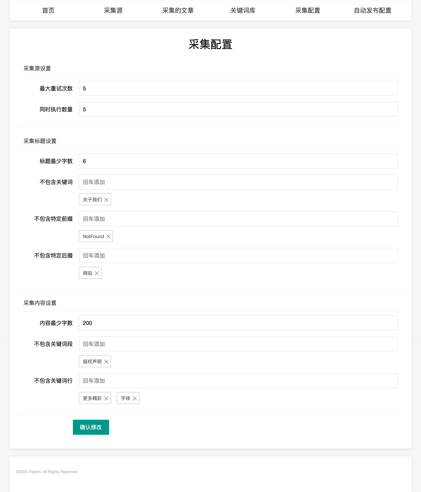
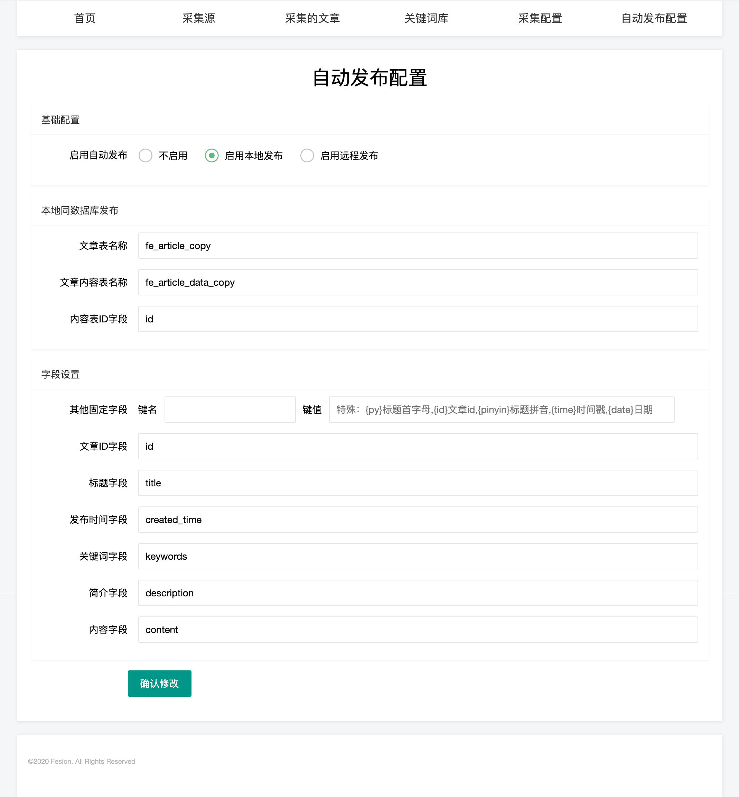
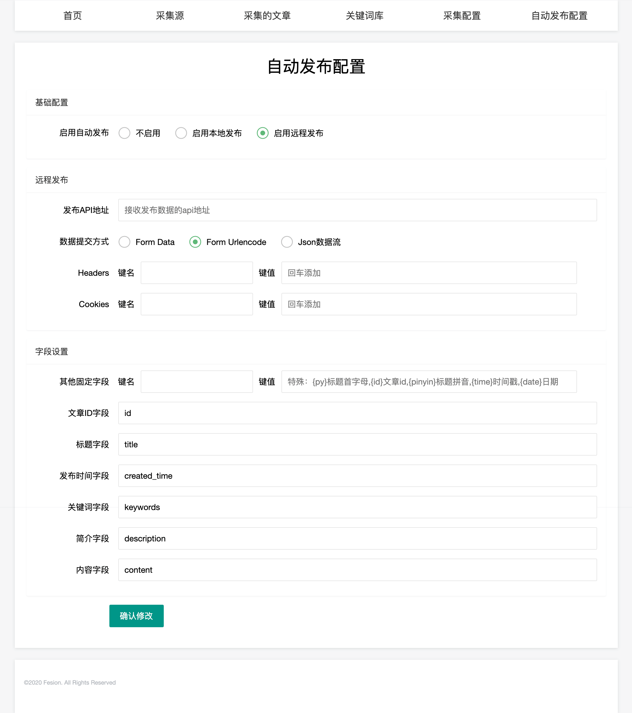

# 不用写采集规则也可以轻松采集网站文章，揭秘一款万能文章采集软件的工作原理

一直以来，大家都在用各种各样的采集器或网站自带的采集功能，如织梦采集侠、火车头采集器、八爪鱼采集器等，这些采集软件都有一个共同的特点，就是要编写采集规则才能采集到文章，这个技术性的问题，对于新手来说，经常都是丈二和尚摸不着头脑，可真不是意见容易的事。即使是对于老站长，需要采集多个网站数据的时候，需要分别给不同的网站写不同的采集规则，也是一个费力费时费事的工作。很多做站群的朋友都深有体会，需要给每个站写采集规则，那简直是苦不堪言。有人说，站长是一个网络搬运工，这话很在理，互联网上的文章，都是你搬我的，我搬你的，互相搬来搬去。那么有没有一个采集软件既免费，又开源的采集软件呢？万能文章采集器就像为你量身定做的采集软件一样，本采集器内置了常用的采集规则，只要添加文章列表连接，就能将内容采集回来。

### 万能文章采集器有什么优势
* 本采集器内置了常用的采集规则，只要添加文章列表连接，就能将内容采集回来。
* 本采集器采用多线程并行采集，可在同一时间采集更多的内容。
* 本采集器只专注于采集文章这一件事，不用来定制采集其他内容，只专心做一件事。

### 万能文章采集器能采集哪些内容
本采集器可以采集到的的内容有：文章标题、文章关键词、文章描述、文章详情内容、文章作者、文章发布时间、文章浏览量。

### 万能文章采集器可用在哪里运行
本采集器可用运行在 Windows系统、Mac 系统、Linux系统（Centos、Ubuntu等），可用下载编译好的程序直接执行，也可以下载源码自己编译。

### 万能文章采集软件使用教程
* 下载万能文章采集软件  
  我们可以从GitHub上下载这个免费的采集软件[https://github.com/fesiong/collector/releases](https://github.com/fesiong/collector/releases)，根据自己的系统，下载适合的软件，比如使用的是Windows系统，则下载collector.windows.zip。使用的linux的用户或需要安装到服务器的用户，可以下载linux版本collector.linux.zip。
  
* 安装万能文章采集器  
  采集器安装非常简单，只需将下载下来的安装包解压，到任意文件夹都可以，然后双击运行collector.exe，默认情况下它会自动打开 http://127.0.0.1:8088 ，如果它不自动打开，则你可以直接在浏览器中输入 http://127.0.0.1:8088 打开，然后会提示填写数据库信息，
  
  因为采集过程需要用到数据库，按正常的网站数据库填写就可以了，类似安装织梦cms等其他cms一样。安装好了就可以开始使用了。
  

* 如何使用万能文章采集器  
  已经安装完毕了，现在你只需要找到你需要采集的网站列表页，添加到数据源中，采集器就会自动开始采集了。数据源你甚至不需要仔细找列表，你也可以直接添加需要采集的网址的首页，都可以，它会自动识别文章数据，并抓取回来。添加完了数据源后，不用着急，采集软件设置了每10分钟采集一次文章列表，每分钟采集一次文章详情。添加完数据源后，只需要等待就可以了。
  
  

* 配置采集规则  
  这一款采集器不需要编写正则表达式，我们可以通过简单的配置来完成采集的规则配置：
  

* 如何自动发布文章到网站  
  采集器自带了2种发布方式，一种是同数据库直接发布，这样的效率是最高的，你可以安装到你的网站同一个数据库中，可以提高发布效率，也可以采用远程发布方式来发布，填写发布地址就可以发布了。
  
  

### 结束语
上面就是万能文章采集器使用方法和工作原理了，按照上面的步骤你可以轻松采集到你想要的文章，它是24小时不间断工作的，你打开了采集器，它就能源源不断的给你采集文章并自动发布了。